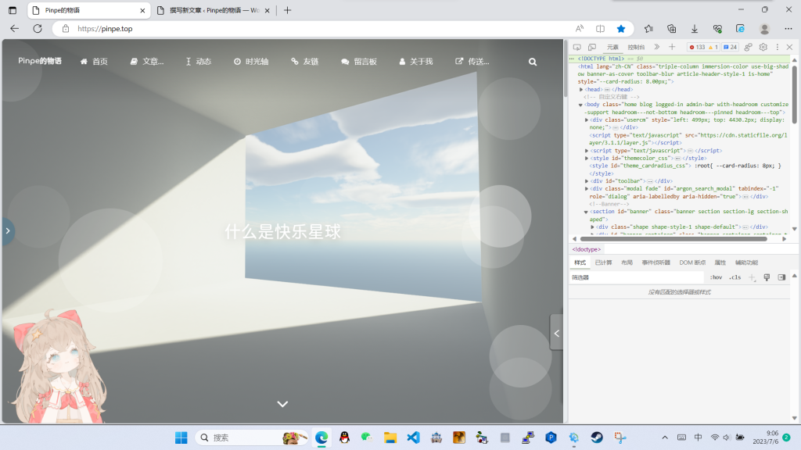
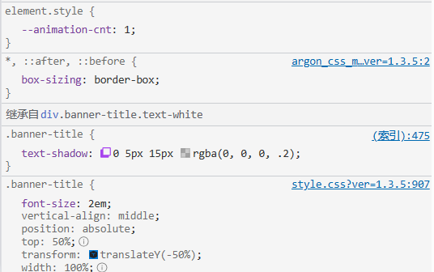
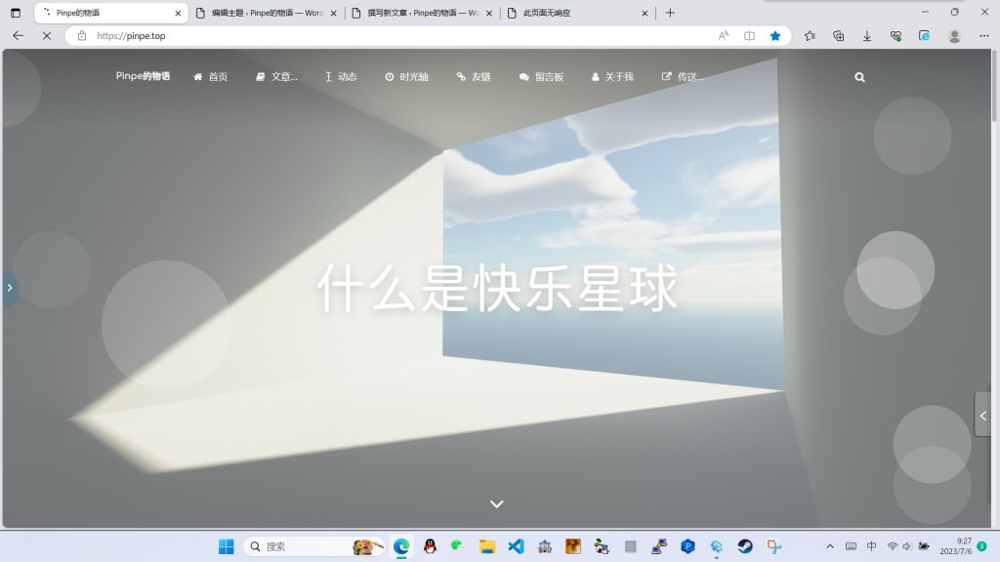

在一些情况下，主题自带的自定义项无法完全满足需求，这个时候就需要修改主题。

### 开始之前

在开始之前，必须了解主题的信息，它是开源的还是付费的，如果是付费的，修改主题可能会被追究法律责任，即使是开源的，也必须保留GitHub之类的开源链接。

以我自己的网站为例子，我使用开源的*Argon*主题。

### 样式的修改

在相应的页面按F12，打开开发者面板。

点击图标（不同的浏览器可能有区别，这是Edge浏览器），然后选取相应的元素。

可以发现面板底下出现了一堆CSS，比如我想改变这个字体大小，可以看到控制字体大小的font-size属性在Style.css的907行。

把这些信息记下来，然后进入WordPress后台>外观>主题文件编辑器，选择样式表文件，移到907行，更改其中的值。

改完后更新文件，就大功告成了，别忘了要使用Ctrl+F5刷新网站。

### 内容的修改

在主题文件编辑器里，不止只有一个样式表文件，还有其它php文件，比如我想修改留言板页面的标题，只需要打开留言板的php文件，找到第42行的

content: '&lt;?php _e("留言板", "argon"); ?>';

并且修改即可。