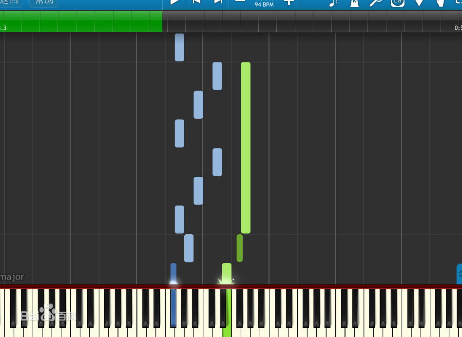
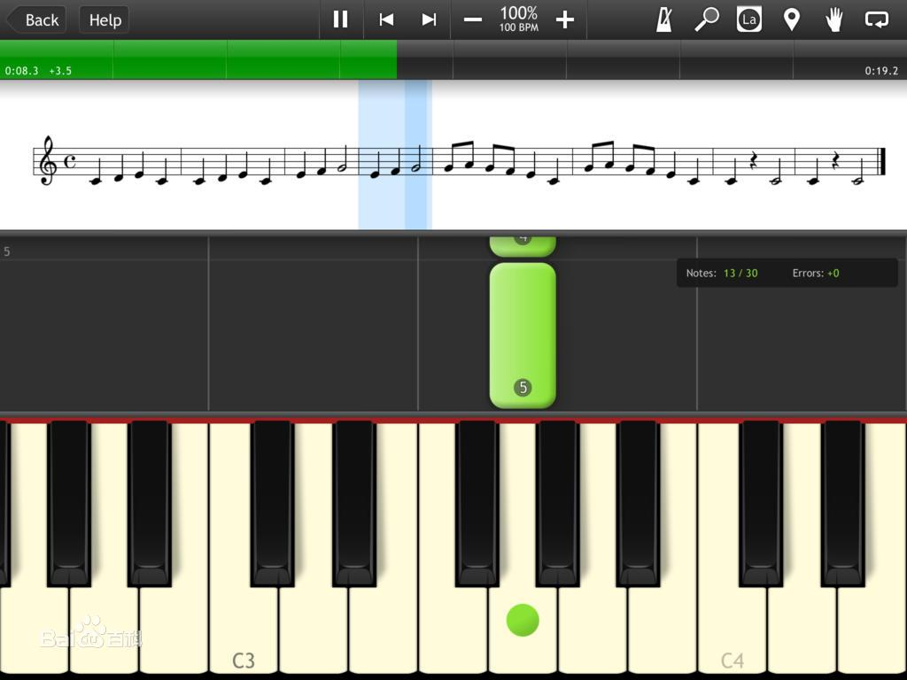
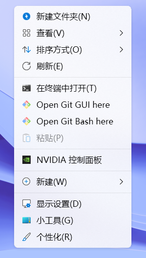
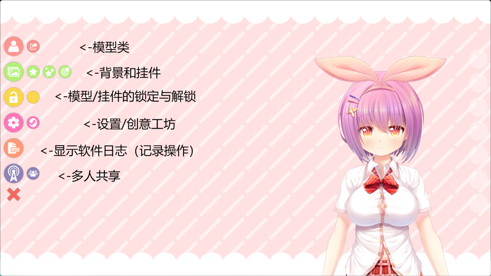
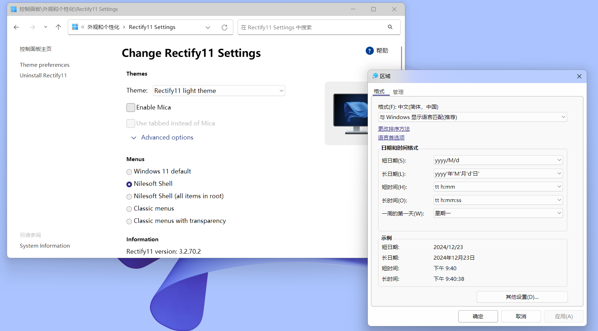
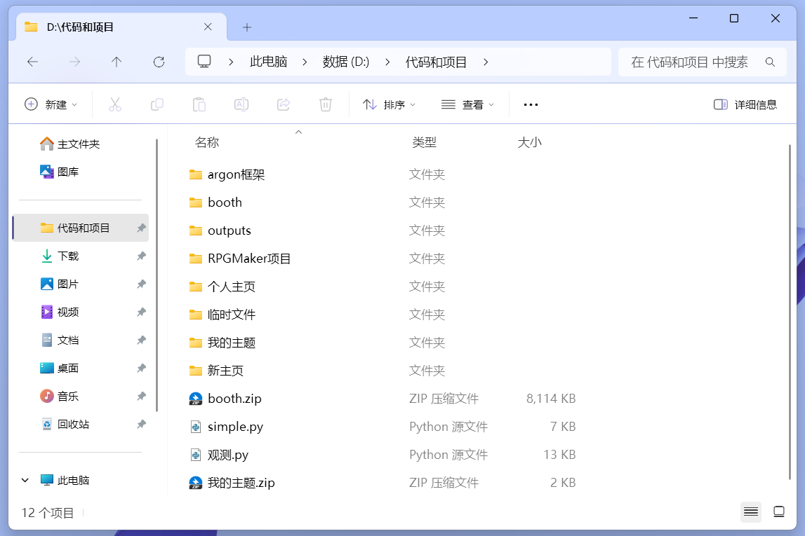
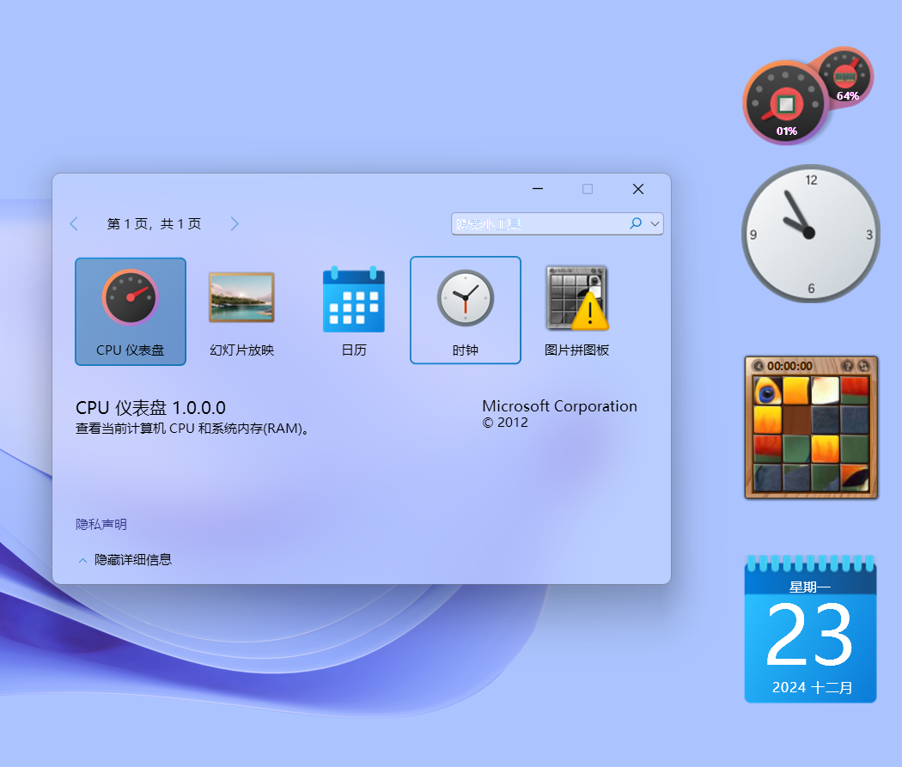
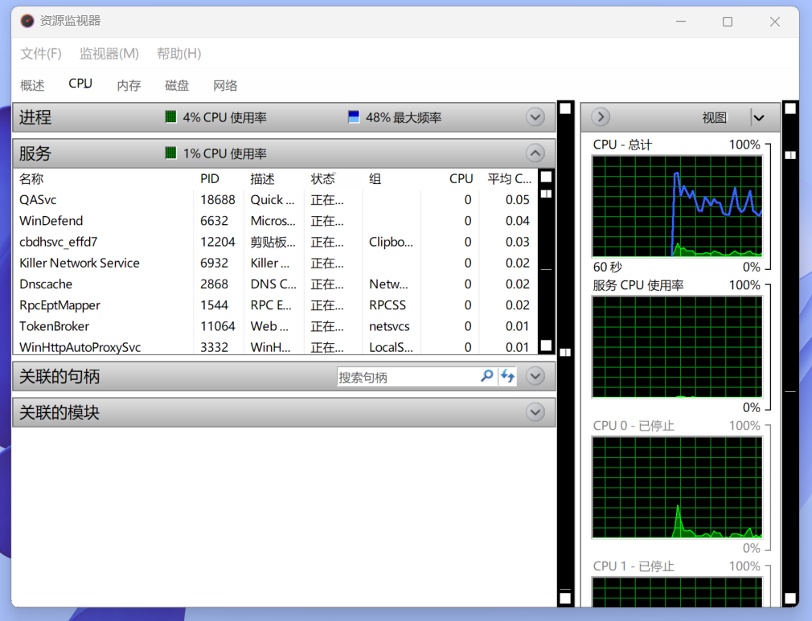
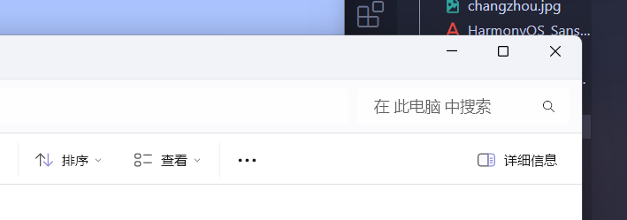

谢谢你们在开始之前说个题外话，真的感谢专门来倾听我和认可我的的观众，让我的直播间有人的气息（否则只能对着空气讲话了），真的非常感谢你们> &lt;

最近在尝试直播（主要是聊天、游戏和技术类型），发现画面只有电脑屏幕，声音也没有直观展示，让人看的像技术、网课之类的比较严肃的直播，而且很无聊，因此套个皮套会更好一点，类似于**虚拟主播**。

那么，该如何满足这个要求呢？

### 下载Steam上的VTube Studio

**VTube Studio**是Steam上的**免费**软件，专门运行**Live2D模型**，并且提供了面部/手部捕捉、挂件、透明推流等基础和高级功能。

Steam下载：[https://store.steampowered.com/app/1325860/VTube_Studio/](https://store.steampowered.com/app/1325860/VTube_Studio/)

### 导入并选择Live2D模型

刚打开软件，你就能看到这样的画面：

这里就是观众的视角，**你可以拖动鼠标来移动人物，也可以双击屏幕来打开菜单**，例如这样：

目前使用的是自带的模型，但有些主播是自己有私皮的，或者是想换别的皮的，就需要自己导入模型，点击“**模型类**”中的“**更改VTS模型**”：

这里会出现自带的五个模型（其中的MO是我后来导入的），你可以选择其中一个，也可以“**导入您自己的模型**”：

点击“**打开文件夹**”，然后将下载下来的模型复制到此文件夹：

然后选择这个模型，就可以看到是想要的样子了：

### 启动面部捕捉

但是此时模型还不能根据你做任何表情，因为并没有启动面部捕捉。

打开“**设置**”，点击摄像机图标的栏目：

这是会有如下设置项：

* **选择摄像头：**面部捕捉必须要一个摄像头，无论是内置的还是外接的。

* **捕捉质量：**选择更加精细还是更快的捕捉算法。

* **捕捉类型：**捕捉面部还是和手部一起捕捉？

然后点击“**面部捕捉 开启**”，即可启动面部捕捉。

最好摘下眼镜或带隐形眼镜经过实践，不是特别建议戴眼镜进行面捕，否则识别稳定性和准确性都会差一大截。因此如果不是必须要戴眼镜，最好摘下眼镜或带隐形眼镜。