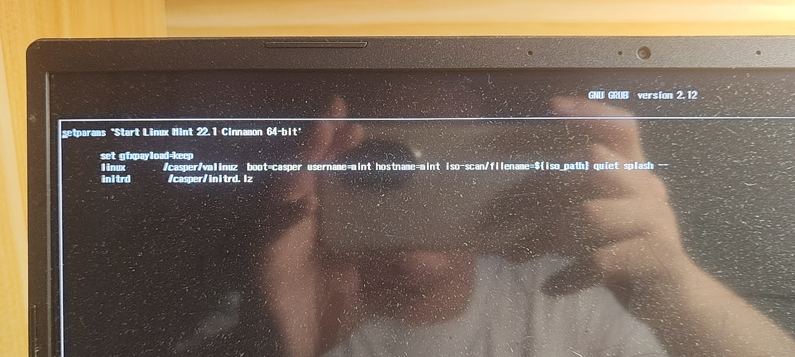
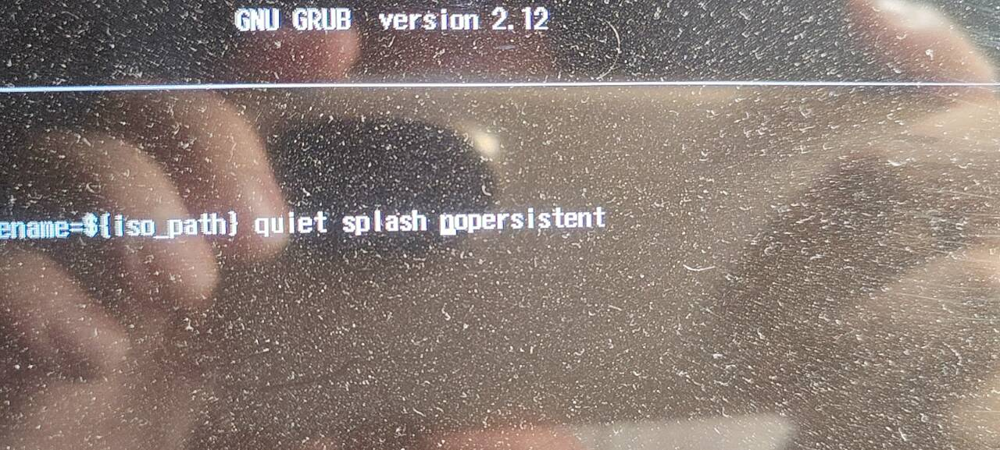

闲的没事干怎么办？那就安装Linux吧！

安装Linux可能有些复杂，因此可能会因为电脑原因还是其它什么的原因，导致踩坑。

因此这篇文章会记录我安装时踩的坑，并提出解决办法。

必要信息电脑型号：**宏碁暗影骑士擎2022**安装系统：**Mint linux**安装方式：**硬盘安装**

警告此文章含有大量的**拍屏图片**。此文章很多内容只能适用与我的电脑，其它电脑需要变通一下，只是给个思路。

### 关闭安全启动

在修改UEFI的启动顺序后，并没有出现应该出现的安装程序，而是这个画面：

这是因为UEFI为了确保安全，不会允许没有签名的启动程序，解决办法是：

* 开机时狂按F2，进入UEFI设置。

* 转到“安全性”菜单，设置管理员密码。（设置了请忽略）

* 转到“启动”菜单，将“安全启动”选项设置为Disabled。

### 创建文件系统失败

在安装程序里面的分区页面中，无法创建文件系统：

这可能是安装程序把硬盘安装当U盘安装了，但我用的是硬盘安装，需要更改安装程序的启动参数：

* 开机第一个画面，按e键。

* 跳到linux那行的最后面，加空格，然后加nopersistent。如图：

* F10启动。