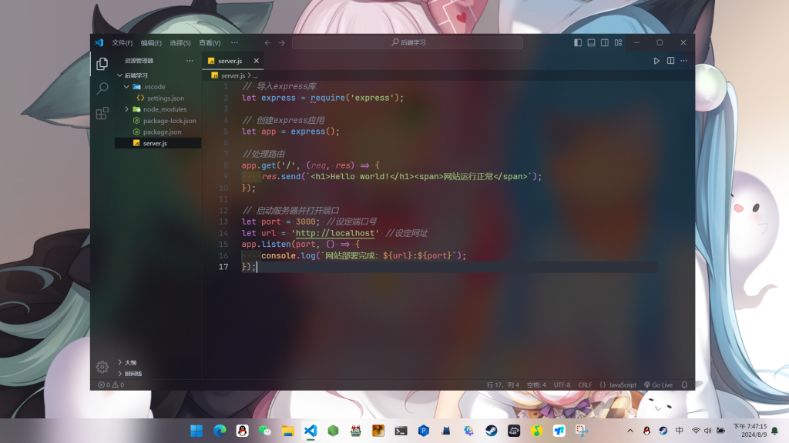
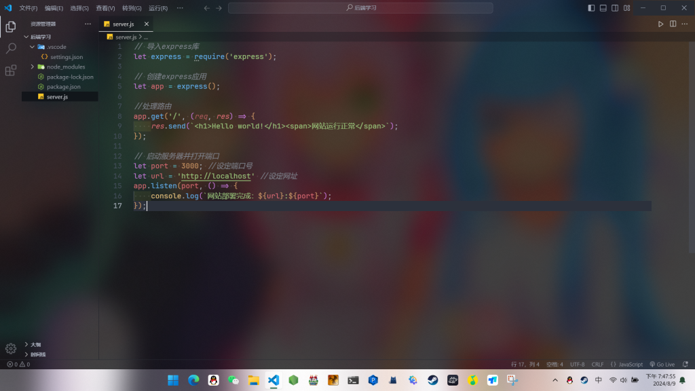
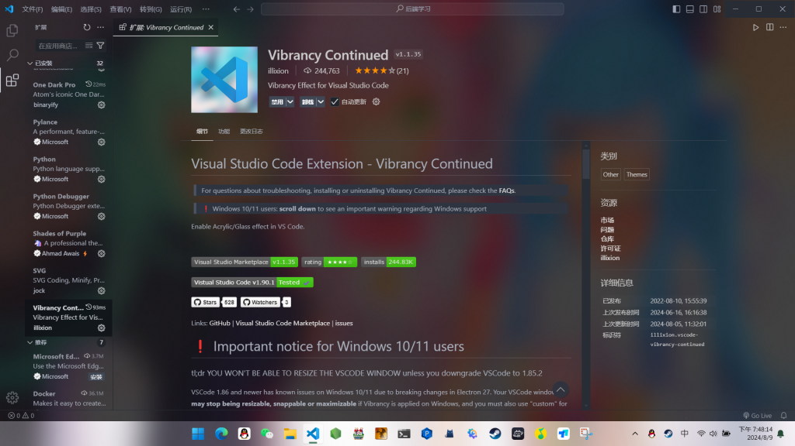
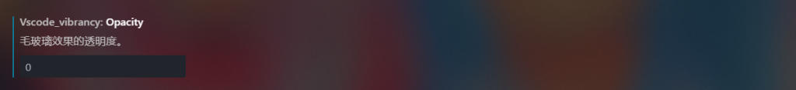
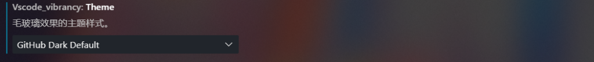

### ❗警告：务必阅读❗

此方法在**Windows10/11**中会导致窗口**无法调整大小和设定最大化**，目前没有对应的解决方案，请你知悉，如果接受不了就可以不用往下看了。

### 👀 效果预览

### 🔧 配置教程

#### 1️⃣ 下载Vibrancy Continued扩展

打开VScode扩展，搜索**Vibrancy Continued**，下载。

#### 2️⃣ 输入命令

开启毛玻璃效果：

>Reload Vibrancy

关闭毛玻璃效果：

>Disable Vibrancy

#### 3️⃣ 优化效果

打开Vscode设置，扩展->Vibrancy Effect，设置以下选项：

#### 🙏 完成！