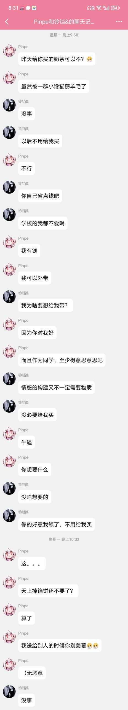
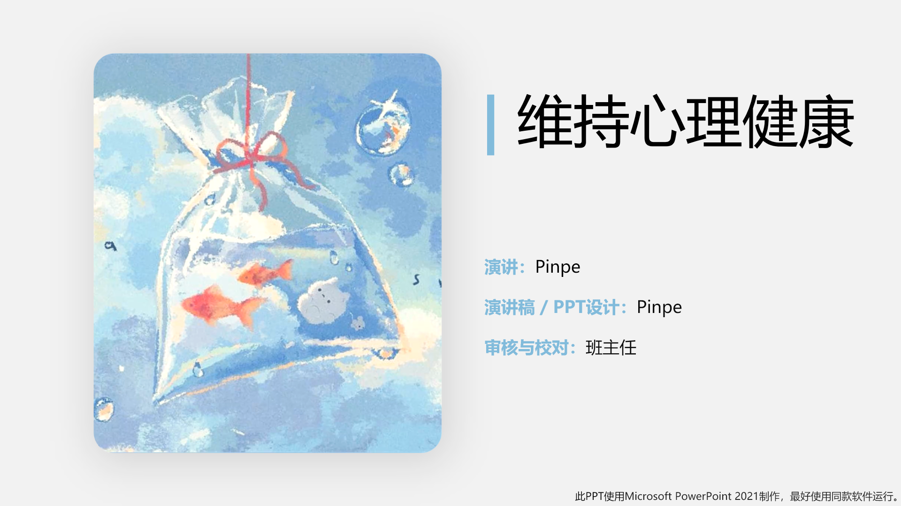
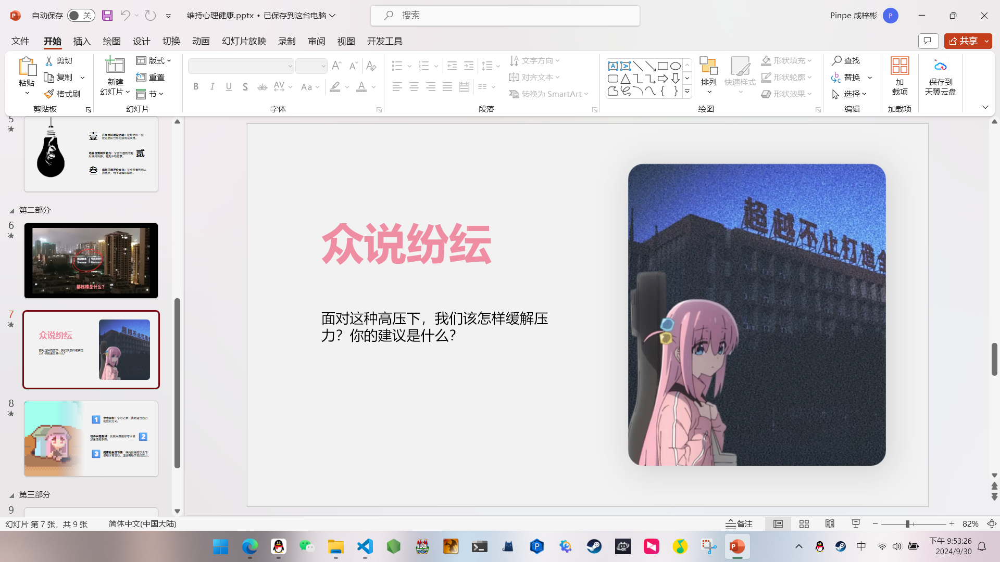
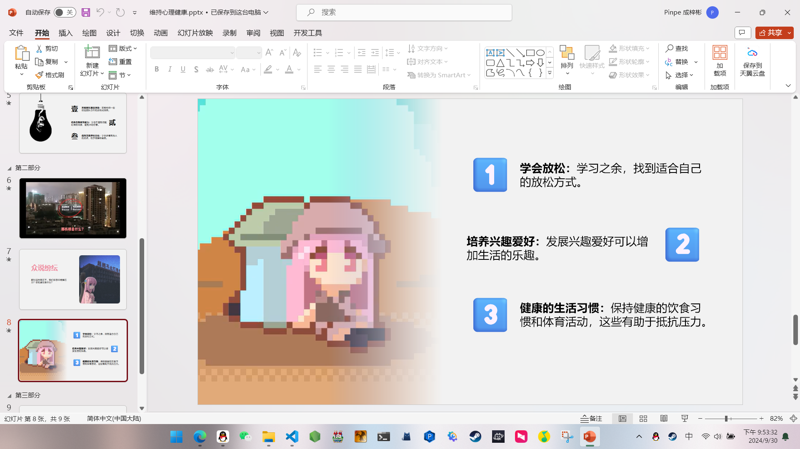
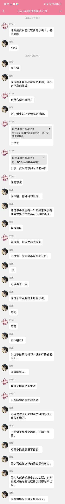

### 初中的时候

你知道我的名字叫什么吗？

你也许会答“Pinpe”，也可能是我的真名。

但是在我初中，同学们都叫我“**傻逼**”，甚至打我，给我穿小鞋。

我不知道为什么他们这样叫我，为什么会对我这样，但是我觉得他们也不怎么样，我无法接受一个满嘴脏话、看到一个“黄巾起义”还高潮的人，这种现象在刚开学时尤其严重。

班主任也差不多，非常保守，还秉持着“**大事化小，小事化了**”的处事原则，这就是一种逃避，而不是真正地解决问题。

因此，我告老师是没用的，只会象征性地说教一下，同学还是屡教不改。告家长更没用，甚至举出了“狗咬人，你还会去咬狗啊？”这样的例子。

我自己也反抗过，但是除了受到笑话以外仍然没有用。（不过用笔尖戳人还有点用）

而且我也没法展示自己的技能，展示了也没用。

### 中考

我成绩很差，中考之前预估只能考到360左右（甚至还可能更低），我家长都给我找好技校了，而且不是完全自己喜欢的专业，当时五年制大专的分控线都有420。

但是这次中考我的数学发挥超常，**原来只能考30~40分，这次竟然直接考了70分，简直不像我考的**，因此我总分竟然考了**396**，同时分控线正好下调到了385，因此我报了**常高职**的**五年制大专**，专业也是我比较喜欢的**计算机网络技术**。

虽然只是个大专，与学霸比还是差了，但已经让我们足够欣喜了。

### 现在的学校

我感觉这个职校每个方面都比初中领先。

首先终于可以不用像初中一样站着狼吞虎咽了，而且有四个食堂，各种类型的饭菜都可以自选慢慢吃，甚至有奶茶喝。

而且还不用上晚自习（仅对走读生，寄宿生还是要上的QwQ），每天**4:20**就放学，作业也就正常水平，这样就有更多时间搞自己的项目了。

同时也有好多社团，各种类型都有，而初中是一点没有的。

另外管理也很严格，生源也比初中好，虽然还是没有太多共同话题，至少不会像初中那样动不动开黄腔说脏话，也会把手机统一收集起来，到了放学才能带回去。（我们班是这样的，别的班就不知道了）

我们的班主任也比较开明，至少会处理一点事情。

### 我与同学们

你知道吗？我现在是“**图形图像处理课代表**”兼“**心理委员**”（试用期），这是我人生中第一次当上“官职”。

同学们对我也好多了，虽然还是认为我是”**老实人**“，但至少不会叫我“傻逼”了，也交到了几个朋友，特别是在图形图像处理课上，我是最强的，同学都得求我帮他们做作业。

我也比之前更加开放，比如我经常给人送礼、一起吃饭，甚至让人觉得不好意思了：

下一届的国旗下讲话让我来也是我主动向班主任提出的，现在演讲稿和PPT也快做完了：

对了，有个同学看了我的小说，也给出了很高的评价：

我不知道这段关系还能维持多久，我不知道什么时候会像初中一样叫我“傻逼”，只能尽可能维持了。