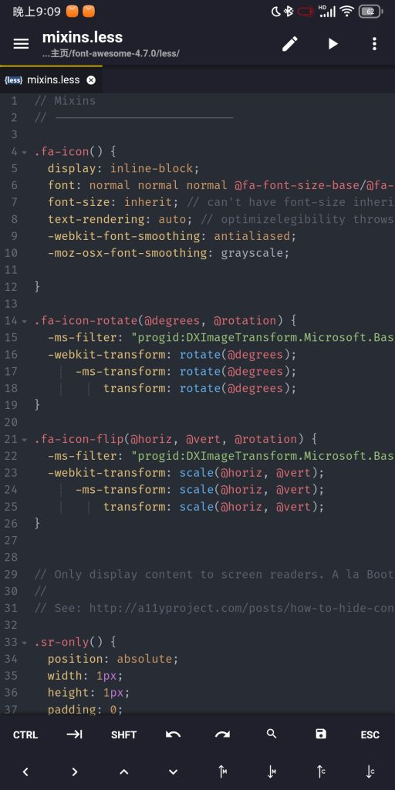
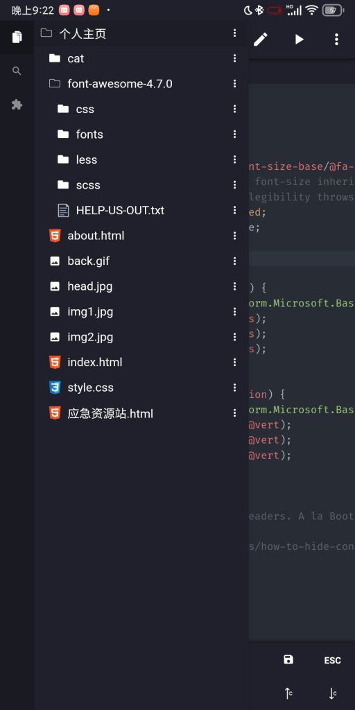
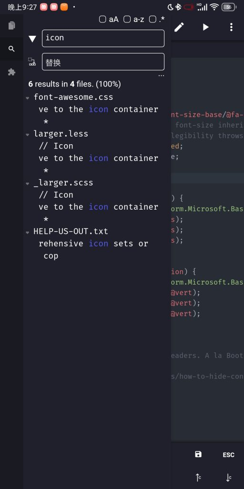
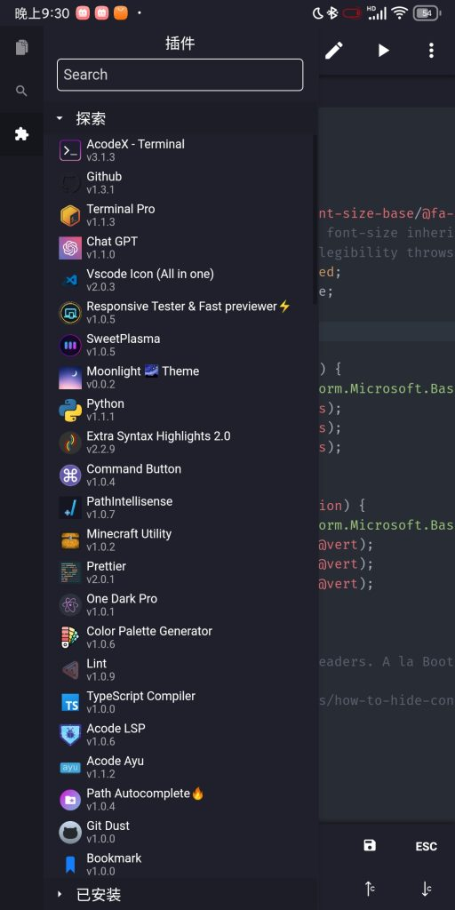

以往，我在手机上编程，对于不同的语言使用不同的 IDE，比如 Python 用 Pydroid，前端用 SpckEditer  等。 

但是这有一个明显的问题——不适合开发多技术栈混合的项目；每个 IDE 的操作方式、代码高亮、功能完整性都不一样，体验上有很强的割裂感。

因此，即使在手机上，也需要有一个“VScode”——那就是 **Acode**。

### 界面设计

打开软件，就是编辑器界面，而且上一次打开的文件和文件夹也自动打开了，非常贴心。

有很多代码高亮主题用，大概整整 30 个左右。输入代码时也有代码补全，任何语言都有，不需要像 VScode 下载对应语言的插件。

打开侧边栏，可以看到有三大板块，分别是文件、搜索、插件。

#### 文件

用于快捷管理项目（文件夹）中的的文件，一目了然。

#### 搜索

用于搜索或替换代码中的特定字段，支持所有文件搜索，支持筛选，与 VScode 不相上下。

#### 插件

这是一个小特点，Acode 支持插件扩展，直接在应用内下载，无需梯子。而且移植了很多主流 VScode 插件：

### 程序的运行

需要注意的是，Acode 本身只能运行前端，不支持编程语言，如果有这个需求就需要使用外力了——Termux。

#### 确保已安装编译器/解释器

运行程序前，请确保编译器/解释器已安装。

如果未安装，可以使用 pkg 命令安装，如安装 Python ：

pkg install python

其它东西也是如此，不多赘述了。

#### 找到项目文件夹

运行程序之前需要找到并打开项目文件夹，否则编译器/解释器容易找不到。如：

cd /storage/emulated/0/代码与项目/

#### 使用编译器/解释器打开程序

接下来只需要输入编译器/解释器专用的命令再加上程序的名称就行了，如：

python 观测.py