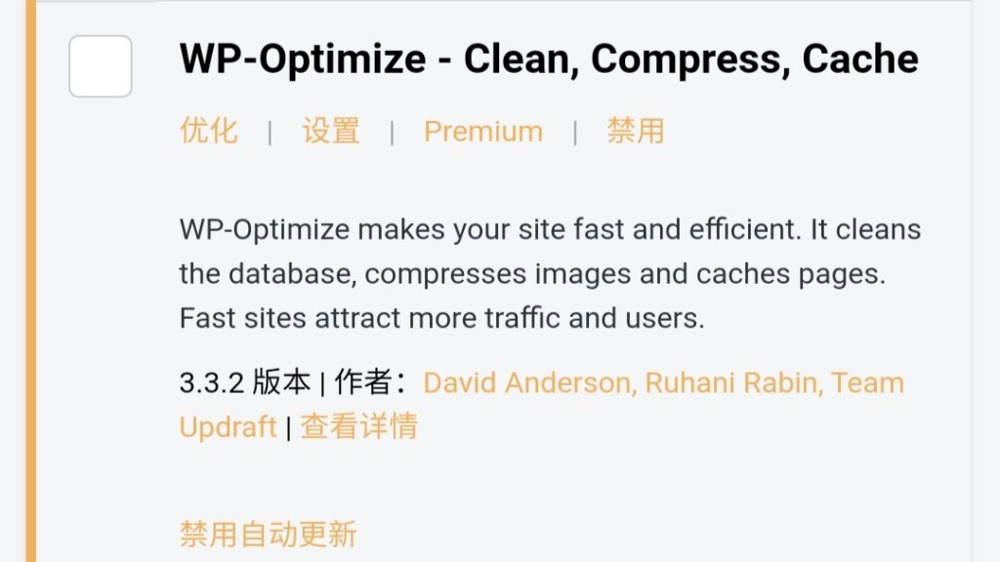

推荐六个我日常使用的六个 WordPress 插件，已经用了好久，并且全部免费。

### 缺陷修复

#### SSL 不安全内容修复器（免费）

顾名思义，用来修复 SSL 覆盖不完全的问题，避免出现报错或安全问题。

#### 超级缓存（免费）

WordPress 太过庞大，会导致页面加载缓慢（特别是低配服务器上），这个插件可以将一些页面转换成静态页面，缓解服务器负担，加快页面加载速度。

### 功能增强

#### Media Cleaner（包含但无需内购）

扫描并清除没有使用的媒体文件。

#### WP-Optimize（包含但无需内购）

扫描并清除文章文章修订记录、自动草稿文章、回收站等乱七八糟的东西。

#### FileBird Lite（包含但无需内购）

如果媒体文件很多，全都挤在一起，很难管理和调用，这个插件可以给媒体库创建分类。

#### WP Branches For Post（免费）

如果没有编辑完一个已经发布的文章或页面，你只能撤销发布，但这个插件可以把已经发布的内容复制并转换成草稿，而不影响发布的内容。

#### WP Statistics（包含但无需内购）

统计访问信息，详尽到每个文章或页面的点击数、访客的国家和地区、访客的浏览平台、反向链接等。

### Argon 专用

#### Argon HuHu Emotions（免费）

给 Argon 的评论区添加“呼呼”表情包，**仅限 Argon 主题**。