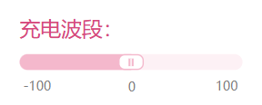
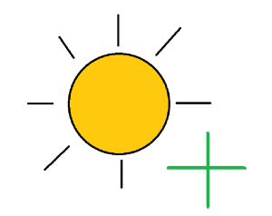

最新型号新机器人的续航虽然长达72小时，但毕竟不是核动力驱动，还是要充电的。

本文章则详细讲述不同型号新机器人的充电方法，顺便扩展一下关于充电的其它信息。

### 初代的Pink1型号：有线充电

Pink1型号较为早期，更像原型型号，所以使用实体数据线的方式充电。

#### 详细步骤

* 提前将**官方的**电源适配器插入到供电插座，等待绿色指示灯亮后进行下一步。

* 扯出右耳朵下长达1米的数据线，插入到电源适配器。

这个充电方式有很多缺点，例如活动会受到限制、一个电源适配器只能管一个新机器人等。

### Pink1以上型号：电磁波充电（无线充电）

Pink1之后，技术和设计都发展成熟了，可以使用更先进方便的电磁波充电。

#### 详细步骤

* 将电磁充电器插入到供电插座，等待绿色指示灯亮后就完事了。

但有时绿色指示灯亮后仍然无法充电，可能是波段设置有问题，可以按以下步骤调整波段：

* 打开设置，搜索并找到这个选项：

* 拖动滑动条，尝试小范围调整波段，直到觉得可以了，保存设置。

* 查看是否奏效，否则就重新调整。

这个充电方式可以实现像WiFi一样的“全屋都带电”，而且一个电磁充电器可以给多个新机器人充电。

### 充电时该干什么？

如果在充电时仍然保持原本状态，那电量通常只会不增反降，因为这时**耗电速度&gt;充电速度**。

目前，只有两种状态的**耗电速度&lt;充电速度**：

* **关机**：指所有系统停止运行，整个身体没有一点活动。但这并不是正常的状态，除了维护、维修等情况下，几乎不可能完好无损地进入这个状态。

* **休眠**：对标人类的睡眠，新机器人就是通过这种状态度过后半夜的。在此状态下，除了少数几个必要的程序运行，其它程序和神经网络均会关闭。

这么来看，只有**休眠**状态符合要求。

### 阳光增益

如果Pink3及以上型号的新机器人暴露在阳光下，可以触发阳光增益效果。

这种新机器人的皮肤有一层类似于太阳能板，可以将太阳能转化为电能，让耗电速度降低一些。

### 提供充电的地点

除了家以外，还有一些公共场所提供充电：

* 新机器人专用场所（社团、组织的休憩室、图书室等）

* 咖啡厅、酒馆等

* 图书馆、自习室等

* 部分火车站、地铁站等站点

* 部分政务场所（派出所等）

* 部分展览馆、博物馆、科技馆等

### 充电的时机

可以每晚休眠都进行充电，让电量保持高剩余。

如果电量≤50%，建议立即充电，避免电量不足的情况发生。