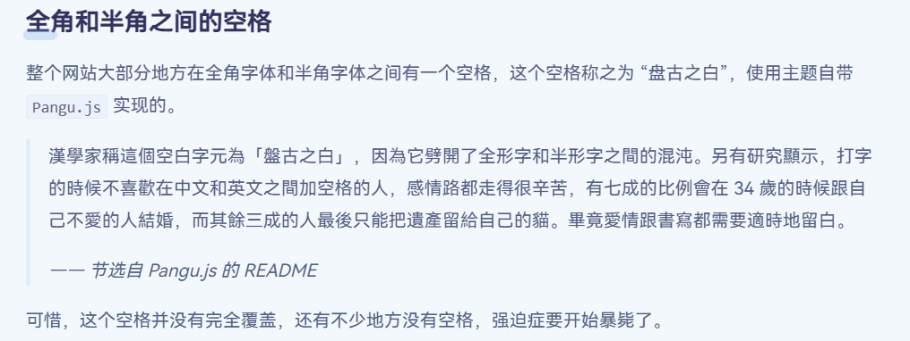

这篇文章我早就应该要写，结果也不知道为什么忘写了（

虽然之前提到过这个，但并没有给出部署教程，说了跟没说一样，而且有点过时了：

因此，这个文章是对这一段内容的扩充。

### pangu.js的Github卡片

[ GitHub](https://github.com/)[vinta/pangu.js](https://github.com/vinta/pangu.js)  

### 详细的部署步骤

#### 使用CDN快速导入库

&lt;head>
    ...
    &lt;script src="https://cdnjs.cloudflare.com/ajax/libs/pangu/4.0.7/pangu.min.js">&lt;/script>
    ...
&lt;/head>

#### 为文字添加空格

这需要分情况，但大多数情况下是为整个页面的文字添加空格，只需在&lt;/body>前插入：

...
    &lt;script>
        document.addEventListener('DOMContentLoaded', () => {
        pangu.autoSpacingPage();
      });
    &lt;/script>
&lt;/body>

如果只是想给特定的对象添加空格，但不要波及到整个页面，就插入：

...
    &lt;script>
          pangu.spacingElementById('main'); // 只给 id 为 main 的元素添加空格
          pangu.spacingElementByClassName('comment'); // 只给 class 为 comment 的元素添加空格
          pangu.spacingElementByTagName('p');  // 只给 p 元素添加空格
    &lt;/script>
&lt;/body>

可根据实际需求修改。