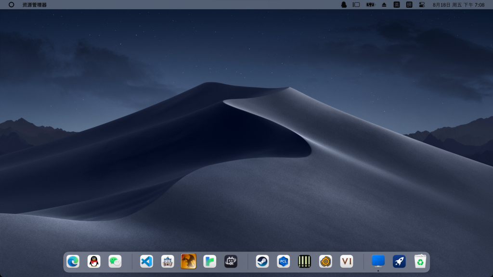
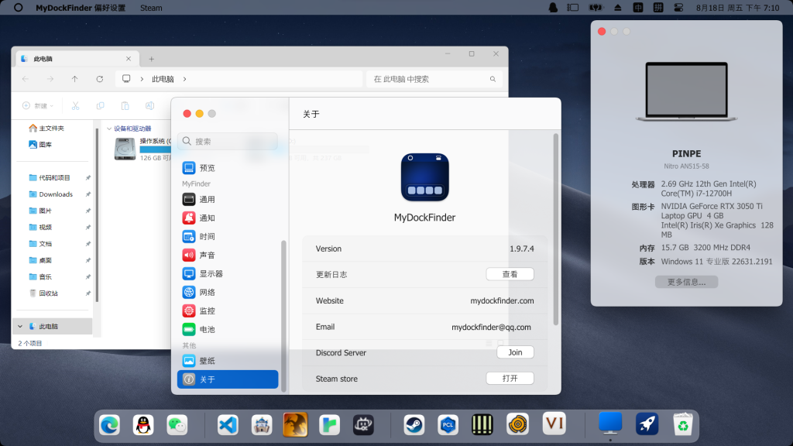
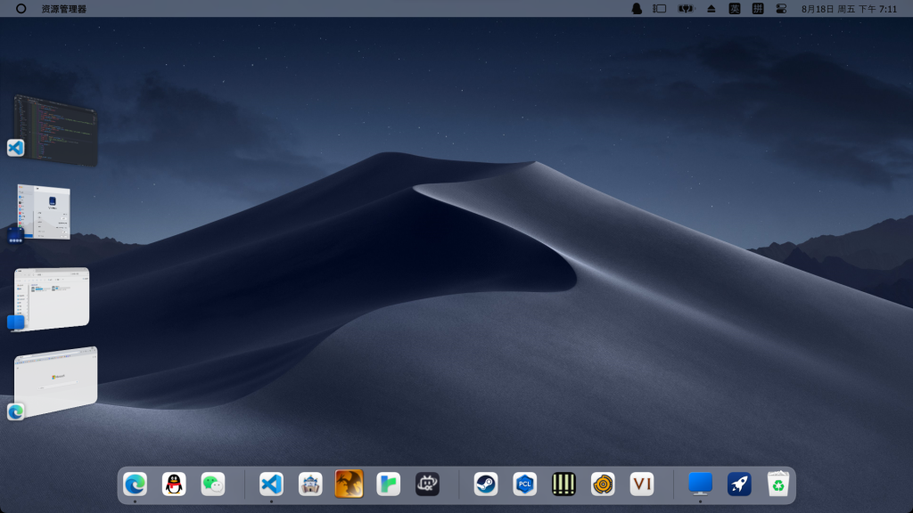
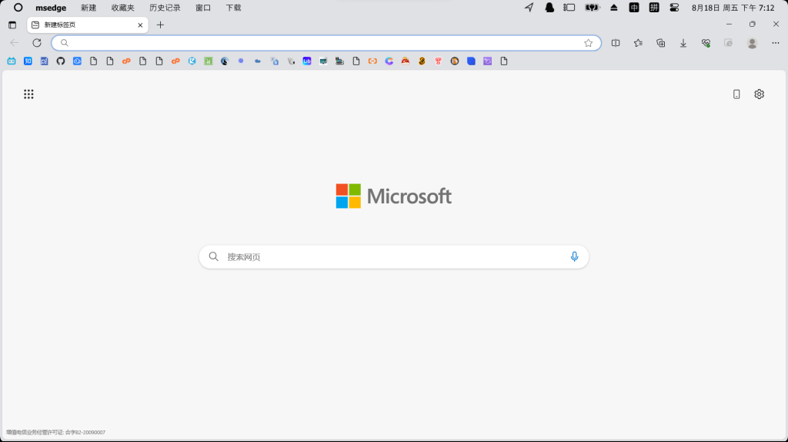
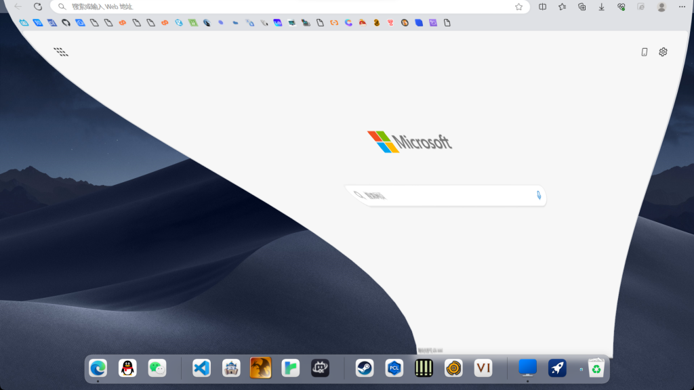

当你想买一个Mac，却发现最便宜的机型也接近一万元，根本买不起。

但是你确实羡慕Mac OS的优雅和颜值，于是你找到了一个平替，也是这篇文章的主角——**MyDockFinder**

### 基础设置和软件导入

在桌面状态下，点击Finder中的资源管理器，找到偏好设置，如果是英文的，将默认语言改成简体中文。

然后找到开机启动方式，选择想要的。（建议选择“服务”）

然后打开启动时自动隐藏任务栏，并选择隐藏所有屏幕任务栏。

最后找到MyDock类别中的启动台选项，找到选择启动台显示的图标，改成添加的图标&amp;开始菜单。

如果想要在Dock中添加软件，可以打开资源管理器软件，把快捷方式、EXE文件、文件夹拖进去。

### 桌面配置

如果想要Mac OS的壁纸，可以去微软商店，下载WinDynamicDesktop，里面有很多壁纸，还可以自动随时间更换。

如果Dock东西很多，可以添加分隔符区分，右击Dock，选择添加分隔符，然后把图标移动到分隔符里面。

还可以去除桌面上的图标，使桌面更加简洁，提升颜值。

相似度高达90%

Tips建议添加图标遮罩，这样图标的大小就能统一了。

### 台前调度

当窗口较多，桌面就开始乱了：

这个软件有台前调度功能，在Finder中就可以打开：

### Finder

Finder可以与一些软件联动，还可以模仿窗口的颜色，看起来浑然一体：

Edge软件的Finder就有新建、收藏夹、历史记录、下载等常用选项。

### 魔鬼特效（神奇效果）

当窗口最小化后，还有魔鬼特效（神奇效果）：

### 缺点和性价比

这个软件在Steam售价24元，但是个人认为性价比不高。

Bug奇多，有些时候动画特效卡甚至没有特效、整体流畅度较低、可能会出现意料之外的情况、听评论说还有可能崩溃，因此得出这个结论。

### 下载

官方网站：[https://www.mydockfinder.com/](https://www.mydockfinder.com/)

Steam：[https://store.steampowered.com/app/1787090/MyDockFinder/](https://store.steampowered.com/app/1787090/MyDockFinder/)

学习版下载：[https://www.52pojie.cn/thread-1777635-1-1.html](https://www.52pojie.cn/thread-1777635-1-1.html)