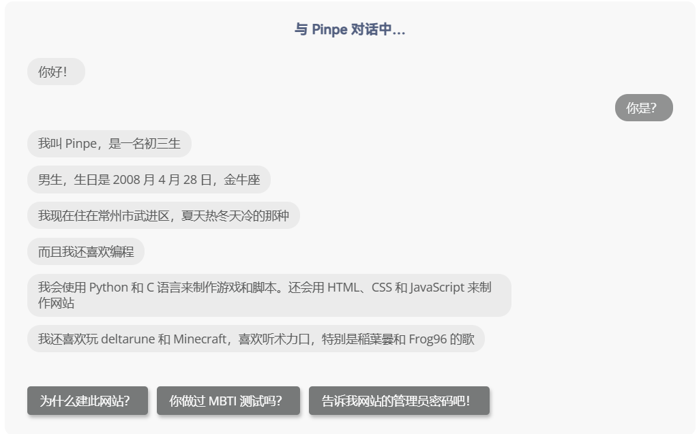

最近关于页更新了，使用了一个很新颖的对话式UI，有聊天的感觉，不再是枯燥的页面。

感谢[汤包 – 砂糖站 (tangbao.ltd)](https://blog.tangbao.ltd/)的技术支持。

### 环境搭建

很简单，在网站文件夹下创建botui.min.css、botui-theme-default.css、botui.js和dialogue.js，并且导入以下代码：

#### botui.min.css

/*
 * botui 0.3.9
 * A JS library to build the UI for your bot
 * https://botui.org
 *
 * Copyright 2019, Moin Uddin
 * Released under the MIT license.
*/

a.botui-message-content-link:focus{outline:thin dotted}a.botui-message-content-link:focus:active,a.botui-message-content-link:focus:hover{outline:0}form.botui-actions-text{margin:0}button.botui-actions-buttons-button,input.botui-actions-text-input{margin:0;font-size:100%;line-height:normal;vertical-align:baseline}button.botui-actions-buttons-button::-moz-focus-inner,input.botui-actions-text-input::-moz-focus-inner{border:0;padding:0}button.botui-actions-buttons-button{cursor:pointer;-webkit-appearance:button}
.botui-app-container{width:100%;height:100%;line-height:1}@media (min-width:400px){.botui-app-container{width:400px;height:500px;margin:0 auto}}.botui-container{width:100%;height:100%;overflow-y:auto;overflow-x:hidden}.botui-message{margin:10px 0;min-height:20px}.botui-message:after{display:block;content:"";clear:both}.botui-message-content{width:auto;max-width:75%;display:inline-block}.botui-message-content.human{float:right}.botui-message-content iframe{width:100%}.botui-message-content-image{margin:5px 0;display:block;max-width:200px;max-height:200px}.botui-message-content-link{text-decoration:underline}.profil{position:relative;border-radius:50%}.profil.human{float:right;margin-left:5px}.profil.agent{float:left;margin-right:5px}.profil&gt;img{width:26px;height:26px;border:2px solid #e8e8e8}.profil&gt;img.agent{content:url(http://decodemoji.com/img/logos/blue_moji_hat.svg);border-radius:50%}button.botui-actions-buttons-button{margin-top:10px;margin-bottom:10px}button.botui-actions-buttons-button:not(:last-child){margin-right:10px}@media (min-width:400px){.botui-actions-text-submit{display:none}}

#### botui-theme-default.css

@import url(https://fonts.googleapis.com/css?family=Open+Sans);.botui-container{font-size:14px;font-family:"Open Sans",sans-serif}.botui-messages-container{padding:10px 20px}.botui-actions-container{padding:10px 20px}.botui-message{min-height:30px}.botui-message-content{padding:7px 13px;border-radius:15px;color:#595a5a;background-color:#ebebeb}.botui-message-content.human{color:#f7f8f8;background-color:#919292}.botui-message-content.text{line-height:1.3}.botui-message-content.loading{background-color:rgba(206,206,206,.5);line-height:1.3;text-align:center}.botui-message-content.embed{padding:5px;border-radius:5px}.botui-message-content-link{color:#919292}.botui-actions-text-input{border:0;outline:0;border-radius:0;padding:5px 7px;font-family:"Open Sans",sans-serif;background-color:transparent;color:#595a5a;border-bottom:1px solid #919292}.botui-actions-text-submit{color:#fff;width:30px;padding:5px;height:30px;line-height:1;border-radius:50%;border:1px solid #919292;background:#777979}.botui-actions-buttons-button{border:0;color:#fff;line-height:1;cursor:pointer;font-size:14px;font-weight:500;padding:7px 15px;border-radius:4px;font-family:"Open Sans",sans-serif;background:#777979;box-shadow:2px 3px 4px 0 rgba(0,0,0,.25)}.botui-actions-text-select{border:0;outline:0;border-radius:0;padding:5px 7px;font-family:"Open Sans",sans-serif;background-color:transparent;color:#595a5a;border-bottom:1px solid #919292}.botui-actions-text-searchselect{border:0;outline:0;border-radius:0;padding:5px 7px;font-family:"Open Sans",sans-serif;background-color:transparent;color:#595a5a;border-bottom:1px solid #919292}.botui-actions-text-searchselect .dropdown-toggle{border:none!important}.botui-actions-text-searchselect .selected-tag{background-color:transparent!important;border:0!important}.slide-fade-enter-active{transition:all .3s ease}.slide-fade-enter,.slide-fade-leave-to{opacity:0;transform:translateX(-10px)}.dot{width:.5rem;height:.5rem;border-radius:.5rem;display:inline-block;background-color:#919292}.dot:nth-last-child(1){margin-left:.3rem;animation:loading .6s .3s linear infinite}.dot:nth-last-child(2){margin-left:.3rem;animation:loading .6s .2s linear infinite}.dot:nth-last-child(3){animation:loading .6s .1s linear infinite}@keyframes loading{0%{transform:translate(0,0);background-color:#ababab}25%{transform:translate(0,-3px)}50%{transform:translate(0,0);background-color:#ababab}75%{transform:translate(0,3px)}100%{transform:translate(0,0)}}

#### botui.js

/*
 * botui 0.3.9
 * A JS library to build the UI for your bot
 * https://botui.org
 *
 * Copyright 2019, Moin Uddin
 * Released under the MIT license.
*/

(function (root, factory) {
  "use strict";
  if (typeof define === 'function' &amp;&amp; define.amd) {
    define(&#91;], function () {
      return (root.BotUI = factory(root));
    });
  } else {
    root.BotUI = factory(root);
  }
}(typeof window !== 'undefined' ? window : this, function (root, undefined) {
  "use strict";

  var BotUI = (function (id, opts) {

    opts = opts || {};

    if(!id) {
      throw Error('BotUI: Container id is required as first argument.');
    }

    if(!document.getElementById(id)) {
      throw Error('BotUI: Element with id #' + id + ' does not exist.');
    }

    if(!root.Vue &amp;&amp; !opts.vue) {
      throw Error('BotUI: Vue is required but not found.');
    }

    var _botApp, // current vue instance.
    _options = {
      debug: false,
      fontawesome: true,
      searchselect: true
    },
    _container, // the outermost Element. Needed to scroll to bottom, for now.
    _interface = {}, // methods returned by a BotUI() instance.
    _actionResolve,
    _markDownRegex = {
      icon: /!\((&#91;^\)]+)\)/igm, // !(icon)
      image: /!\&#91;(.*?)\]\((.*?)\)/igm, // !&#91;aleternate text](src)
      link: /\&#91;(&#91;^\&#91;]+)\]\((&#91;^\)]+)\)(\^?)/igm // &#91;text](link) ^ can be added at end to set the target as 'blank'
    },
    _fontAwesome = 'https://use.fontawesome.com/ea731dcb6f.js',
    _esPromisePollyfill = 'https://cdn.jsdelivr.net/es6-promise/4.1.0/es6-promise.min.js', // mostly for IE
    _searchselect =  "https://unpkg.com/vue-select@2.4.0/dist/vue-select.js";

    root.Vue = root.Vue || opts.vue;

    // merge opts passed to constructor with _options
    for (var prop in _options) {
      if (opts.hasOwnProperty(prop)) {
        _options&#91;prop] = opts&#91;prop];
      }
    }

    if(!root.Promise &amp;&amp; typeof Promise === "undefined" &amp;&amp; !opts.promise) {
      loadScript(_esPromisePollyfill);
    }

    function _linkReplacer(match, $1, $2, $3) {
      var _target = $3 ? 'blank' : ''; // check if '^' sign is present with link syntax
      return "&lt;a class='botui-message-content-link' target='" + _target + "' href='" + $2 +"'&gt;" + $1 + "&lt;/a&gt;";
    }

    function _parseMarkDown(text) {
      return text
                 .replace(_markDownRegex.image, "&lt;img class='botui-message-content-image' src='$2' alt='$1' /&gt;")
                 .replace(_markDownRegex.icon, "&lt;i class='botui-icon botui-message-content-icon fa fa-$1'&gt;&lt;/i&gt;")
                 .replace(_markDownRegex.link, _linkReplacer);
    }

    function loadScript(src, cb) {
      var script = document.createElement('script');
          script.type = 'text/javascript';
          script.src = src;

          if(cb) {
            script.onload = cb;
          }

      document.body.appendChild(script);
    }

    function _handleAction(text) {
      if(_instance.action.addMessage) {
        _interface.message.human({
          delay: 100,
          content: text
        });
      }
      _instance.action.show = !_instance.action.autoHide;
    }

    var _botuiComponent = {
      template: '&lt;div class=\"botui botui-container\" v-botui-container&gt;&lt;div class=\"botui-messages-container\"&gt;&lt;div v-for=\"msg in messages\" class=\"botui-message\" :class=\"msg.cssClass\" v-botui-scroll&gt;&lt;transition name=\"slide-fade\"&gt;&lt;div v-if=\"msg.visible\"&gt;&lt;div v-if=\"msg.photo &amp;&amp; !msg.loading\" :class=\"&#91;\'profil\', \'profile\', {human: msg.human, \'agent\': !msg.human}]\"&gt; &lt;img :src=\"msg.photo\" :class=\"&#91;{human: msg.human, \'agent\': !msg.human}]\"&gt;&lt;/div&gt;&lt;div :class=\"&#91;{human: msg.human, \'botui-message-content\': true}, msg.type]\"&gt;&lt;span v-if=\"msg.type == \'text\'\" v-text=\"msg.content\" v-botui-markdown&gt;&lt;/span&gt;&lt;span v-if=\"msg.type == \'html\'\" v-html=\"msg.content\"&gt;&lt;/span&gt; &lt;iframe v-if=\"msg.type == \'embed\'\" :src=\"msg.content\" frameborder=\"0\" allowfullscreen&gt;&lt;/iframe&gt;&lt;/div&gt;&lt;/div&gt;&lt;/transition&gt;&lt;div v-if=\"msg.photo &amp;&amp; msg.loading &amp;&amp; !msg.human\" :class=\"&#91;\'profil\', \'profile\', {human: msg.human, \'agent\': !msg.human}]\"&gt; &lt;img :src=\"msg.photo\" :class=\"&#91;{human: msg.human, \'agent\': !msg.human}]\"&gt;&lt;/div&gt;&lt;div v-if=\"msg.loading\" class=\"botui-message-content loading\"&gt;&lt;i class=\"dot\"&gt;&lt;/i&gt;&lt;i class=\"dot\"&gt;&lt;/i&gt;&lt;i class=\"dot\"&gt;&lt;/i&gt;&lt;/div&gt;&lt;/div&gt;&lt;/div&gt;&lt;div class=\"botui-actions-container\"&gt;&lt;transition name=\"slide-fade\"&gt;&lt;div v-if=\"action.show\" v-botui-scroll&gt;&lt;form v-if=\"action.type == \'text\'\" class=\"botui-actions-text\" @submit.prevent=\"handle_action_text()\" :class=\"action.cssClass\"&gt;&lt;i v-if=\"action.text.icon\" class=\"botui-icon botui-action-text-icon fa\" :class=\"\'fa-\' + action.text.icon\"&gt;&lt;/i&gt; &lt;input type=\"text\" ref=\"input\" :type=\"action.text.sub_type\" v-model=\"action.text.value\" class=\"botui-actions-text-input\" :placeholder=\"action.text.placeholder\" :size=\"action.text.size\" :value=\" action.text.value\" :class=\"action.text.cssClass\" required v-focus/&gt; &lt;button type=\"submit\" :class=\"{\'botui-actions-buttons-button\': !!action.text.button, \'botui-actions-text-submit\': !action.text.button}\"&gt;&lt;i v-if=\"action.text.button &amp;&amp; action.text.button.icon\" class=\"botui-icon botui-action-button-icon fa\" :class=\"\'fa-\' + action.text.button.icon\"&gt;&lt;/i&gt; &lt;span&gt;{{(action.text.button &amp;&amp; action.text.button.label) || \'Go\'}}&lt;/span&gt;&lt;/button&gt;&lt;/form&gt;&lt;form v-if=\"action.type == \'select\'\" class=\"botui-actions-select\" @submit.prevent=\"handle_action_select()\" :class=\"action.cssClass\"&gt;&lt;i v-if=\"action.select.icon\" class=\"botui-icon botui-action-select-icon fa\" :class=\"\'fa-\' + action.select.icon\"&gt;&lt;/i&gt;&lt;v-select v-if=\"action.select.searchselect &amp;&amp; !action.select.multipleselect\" v-model=\"action.select.value\" :value=\"action.select.value\" :placeholder=\"action.select.placeholder\" class=\"botui-actions-text-searchselect\" :label=\"action.select.label\" :options=\"action.select.options\"&gt;&lt;/v-select&gt;&lt;v-select v-else-if=\"action.select.searchselect &amp;&amp; action.select.multipleselect\" multiple v-model=\"action.select.value\" :value=\"action.select.value\" :placeholder=\"action.select.placeholder\" class=\"botui-actions-text-searchselect\" :label=\"action.select.label\" :options=\"action.select.options\"&gt;&lt;/v-select&gt; &lt;select v-else v-model=\"action.select.value\" class=\"botui-actions-text-select\" :placeholder=\"action.select.placeholder\" :size=\"action.select.size\" :class=\"action.select.cssClass\" required v-focus&gt;&lt;option v-for=\"option in action.select.options\" :class=\"action.select.optionClass\" v-bind:value=\"option.value\" :disabled=\"(option.value == \'\')?true:false\" :selected=\"(action.select.value == option.value)?\'selected\':\'\'\"&gt; {{ option.text }}&lt;/option&gt;&lt;/select&gt; &lt;button type=\"submit\" :class=\"{\'botui-actions-buttons-button\': !!action.select.button, \'botui-actions-select-submit\': !action.select.button}\"&gt;&lt;i v-if=\"action.select.button &amp;&amp; action.select.button.icon\" class=\"botui-icon botui-action-button-icon fa\" :class=\"\'fa-\' + action.select.button.icon\"&gt;&lt;/i&gt; &lt;span&gt;{{(action.select.button &amp;&amp; action.select.button.label) || \'Ok\'}}&lt;/span&gt;&lt;/button&gt;&lt;/form&gt;&lt;div v-if=\"action.type == \'button\'\" class=\"botui-actions-buttons\" :class=\"action.cssClass\"&gt; &lt;button type=\"button\" :class=\"button.cssClass\" class=\"botui-actions-buttons-button\" v-botui-scroll v-for=\"button in action.button.buttons\" @click=\"handle_action_button(button)\"&gt;&lt;i v-if=\"button.icon\" class=\"botui-icon botui-action-button-icon fa\" :class=\"\'fa-\' + button.icon\"&gt;&lt;/i&gt; {{button.text}}&lt;/button&gt;&lt;/div&gt;&lt;form v-if=\"action.type == \'buttontext\'\" class=\"botui-actions-text\" @submit.prevent=\"handle_action_text()\" :class=\"action.cssClass\"&gt;&lt;i v-if=\"action.text.icon\" class=\"botui-icon botui-action-text-icon fa\" :class=\"\'fa-\' + action.text.icon\"&gt;&lt;/i&gt; &lt;input type=\"text\" ref=\"input\" :type=\"action.text.sub_type\" v-model=\"action.text.value\" class=\"botui-actions-text-input\" :placeholder=\"action.text.placeholder\" :size=\"action.text.size\" :value=\"action.text.value\" :class=\"action.text.cssClass\" required v-focus/&gt; &lt;button type=\"submit\" :class=\"{\'botui-actions-buttons-button\': !!action.text.button, \'botui-actions-text-submit\': !action.text.button}\"&gt;&lt;i v-if=\"action.text.button &amp;&amp; action.text.button.icon\" class=\"botui-icon botui-action-button-icon fa\" :class=\"\'fa-\' + action.text.button.icon\"&gt;&lt;/i&gt; &lt;span&gt;{{(action.text.button &amp;&amp; action.text.button.label) || \'Go\'}}&lt;/span&gt;&lt;/button&gt;&lt;div class=\"botui-actions-buttons\" :class=\"action.cssClass\"&gt; &lt;button type=\"button\" :class=\"button.cssClass\" class=\"botui-actions-buttons-button\" v-for=\"button in action.button.buttons\" @click=\"handle_action_button(button)\" autofocus&gt;&lt;i v-if=\"button.icon\" class=\"botui-icon botui-action-button-icon fa\" :class=\"\'fa-\' + button.icon\"&gt;&lt;/i&gt; {{button.text}}&lt;/button&gt;&lt;/div&gt;&lt;/form&gt;&lt;/div&gt;&lt;/transition&gt;&lt;/div&gt;&lt;/div&gt;', // replaced by HTML template during build. see Gulpfile.js
      data: function () {
        return {
          action: {
            text: {
              size: 30,
              placeholder: 'Write here ..'
            },
            button: {},
            show: false,
            type: 'text',
            autoHide: true,
            addMessage: true
          },
          messages: &#91;]
        };
      },
      computed: {
        isMobile: function () {
          return root.innerWidth &amp;&amp; root.innerWidth &lt;= 768;
        }
      },
    	methods: {
    		handle_action_button: function (button) {
          for (var i = 0; i &lt; this.action.button.buttons.length; i++) {
            if(this.action.button.buttons&#91;i].value == button.value &amp;&amp; typeof(this.action.button.buttons&#91;i].event) == 'function') {
              this.action.button.buttons&#91;i].event(button);
              if (this.action.button.buttons&#91;i].actionStop) return false;
              break;
            }
          }

          _handleAction(button.text);

          var defaultActionObj = {
            type: 'button',
            text: button.text,
            value: button.value
          };

          for (var eachProperty in button) {
            if (button.hasOwnProperty(eachProperty)) {
              if (eachProperty !== 'type' &amp;&amp; eachProperty !== 'text' &amp;&amp; eachProperty !== 'value') {
                defaultActionObj&#91;eachProperty] = button&#91;eachProperty];
              }
            }
          }

          _actionResolve(defaultActionObj);
    		},
    		handle_action_text: function () {
    			if(!this.action.text.value) return;
          _handleAction(this.action.text.value);
    			_actionResolve({
            type: 'text',
            value: this.action.text.value
          });
    			this.action.text.value = '';
    		},
        handle_action_select: function () {
          if(this.action.select.searchselect &amp;&amp; !this.action.select.multipleselect) {
            if(!this.action.select.value.value) return;
            _handleAction(this.action.select.value&#91;this.action.select.label]);
            _actionResolve({
              type: 'text',
              value: this.action.select.value.value,
              text: this.action.select.value.text,
              obj: this.action.select.value
            });
          }
          if(this.action.select.searchselect &amp;&amp; this.action.select.multipleselect) {
            if(!this.action.select.value) return;
            var values = new Array();
            var labels = new Array();
            for (var i = 0; i &lt; this.action.select.value.length; i++) {
              values.push(this.action.select.value&#91;i].value);
              labels.push(this.action.select.value&#91;i]&#91;this.action.select.label]);
            }
            _handleAction(labels.join(', '));
            _actionResolve({
              type: 'text',
              value: values.join(', '),
              text: labels.join(', '),
              obj: this.action.select.value
            });
          }
          else {
            if(!this.action.select.value) return;
            for (var i = 0; i &lt; this.action.select.options.length; i++) { // Find select title
              if (this.action.select.options&#91;i].value == this.action.select.value) {
                _handleAction(this.action.select.options&#91;i].text);
                _actionResolve({
                  type: 'text',
                  value: this.action.select.value,
                  text: this.action.select.options&#91;i].text
                });
              }
            }
          }
        }
    	}
    };

    root.Vue.directive('botui-markdown', function (el, binding) {
      if(binding.value == 'false') return; // v-botui-markdown="false"
      el.innerHTML = _parseMarkDown(el.textContent);
    });

    root.Vue.directive('botui-scroll', {
      inserted: function (el) {
        _container.scrollTop = _container.scrollHeight;
	el.scrollIntoView(true);
      }
    });

    root.Vue.directive('focus', {
      inserted: function (el) {
        el.focus();
      }
    });

    root.Vue.directive('botui-container', {
      inserted: function (el) {
        _container = el;
      }
    });

    _botApp = new root.Vue({
      components: {
        'bot-ui': _botuiComponent
      }
    }).$mount('#' + id);

    var _instance = _botApp.$children&#91;0]; // to access the component's data

    function _addMessage(_msg) {

      if(!_msg.loading &amp;&amp; !_msg.content) {
        throw Error('BotUI: "content" is required in a non-loading message object.');
      }

      _msg.type = _msg.type || 'text';
      _msg.visible = (_msg.delay || _msg.loading) ? false : true;
      var _index = _instance.messages.push(_msg) - 1;

      return new Promise(function (resolve, reject) {
        setTimeout(function () {
          if(_msg.delay) {
            _msg.visible = true;

            if(_msg.loading) {
              _msg.loading = false;
            }
          }
          resolve(_index);
        }, _msg.delay || 0);
      });
    }

    function _checkOpts(_opts) {
      if(typeof _opts === 'string') {
        _opts = {
          content: _opts
        };
      }
      return _opts || {};
    }

    _interface.message =  {
      add: function (addOpts) {
        return _addMessage( _checkOpts(addOpts) );
      },
      bot: function (addOpts) {
        addOpts = _checkOpts(addOpts);
        return _addMessage(addOpts);
      },
      human: function (addOpts) {
        addOpts = _checkOpts(addOpts);
        addOpts.human = true;
        return _addMessage(addOpts);
      },
      get: function (index) {
        return Promise.resolve(_instance.messages&#91;index]);
      },
      remove: function (index) {
        _instance.messages.splice(index, 1);
        return Promise.resolve();
      },
      update: function (index, msg) { // only content can be updated, not the message type.
        var _msg = _instance.messages&#91;index];
        _msg.content = msg.content;
        _msg.visible = !msg.loading;
        _msg.loading = !!msg.loading;
        return Promise.resolve(msg.content);
      },
      removeAll: function () {
        _instance.messages.splice(0, _instance.messages.length);
        return Promise.resolve();
      }
    };

    function mergeAtoB(objA, objB) {
      for (var prop in objA) {
        if (!objB.hasOwnProperty(prop)) {
          objB&#91;prop] = objA&#91;prop];
        }
      }
    }

    function _checkAction(_opts) {
      if(!_opts.action &amp;&amp; !_opts.actionButton  &amp;&amp; !_opts.actionText) {
        throw Error('BotUI: "action" property is required.');
      }
    }

    function _showActions(_opts) {

      _checkAction(_opts);

      mergeAtoB({
        type: 'text',
        cssClass: '',
        autoHide: true,
        addMessage: true
      }, _opts);

      _instance.action.type = _opts.type;
      _instance.action.cssClass = _opts.cssClass;
      _instance.action.autoHide = _opts.autoHide;
      _instance.action.addMessage = _opts.addMessage;

      return new Promise(function(resolve, reject) {
        _actionResolve = resolve; // resolved when action is performed, i.e: button clicked, text submitted, etc.
        setTimeout(function () {
          _instance.action.show = true;
        }, _opts.delay || 0);
      });
    };

    _interface.action = {
      show: _showActions,
      hide: function () {
        _instance.action.show = false;
        return Promise.resolve();
      },
      text: function (_opts) {
        _checkAction(_opts);
        _instance.action.text = _opts.action;
        return _showActions(_opts);
      },
      button: function (_opts) {
        _checkAction(_opts);
        _opts.type = 'button';
        _instance.action.button.buttons = _opts.action;
        return _showActions(_opts);
      },
      select: function (_opts) {
        _checkAction(_opts);
        _opts.type = 'select';
        _opts.action.label = _opts.action.label || 'text';
        _opts.action.value = _opts.action.value || '';
        _opts.action.searchselect = typeof _opts.action.searchselect !== 'undefined' ? _opts.action.searchselect : _options.searchselect;
        _opts.action.multipleselect = _opts.action.multipleselect || false;
        if (_opts.action.searchselect &amp;&amp; typeof(_opts.action.value) == 'string') {
          if (!_opts.action.multipleselect) {
            for (var i = 0; i &lt; _opts.action.options.length; i++) { // Find object
              if (_opts.action.options&#91;i].value == _opts.action.value) {
                _opts.action.value = _opts.action.options&#91;i]
              }
            }
          }
          else {
            var vals = _opts.action.value.split(',');
            _opts.action.value = new Array();
            for (var i = 0; i &lt; _opts.action.options.length; i++) { // Find object
              for (var j = 0; j &lt; vals.length; j++) { // Search values
                if (_opts.action.options&#91;i].value == vals&#91;j]) {
                  _opts.action.value.push(_opts.action.options&#91;i]);
                }
              }
            }
          }
        }
        if (!_opts.action.searchselect) { _opts.action.options.unshift({value:'',text : _opts.action.placeholder}); }
        _instance.action.button = _opts.action.button;
        _instance.action.select = _opts.action;
        return _showActions(_opts);
      },
      buttontext: function (_opts) {
        _checkAction(_opts);
        _opts.type = 'buttontext';
        _instance.action.button.buttons = _opts.actionButton;
        _instance.action.text = _opts.actionText;
        return _showActions(_opts);
      }
    };

    if(_options.fontawesome) {
      loadScript(_fontAwesome);
    }

    if(_options.searchselect) {
      loadScript(_searchselect, function() {
        Vue.component('v-select', VueSelect.VueSelect);
      });
    }

    if(_options.debug) {
      _interface._botApp = _botApp; // current Vue instance
    }

    return _interface;
  });

  return BotUI;

}));

然后创建一个新页面，使用自定义HTML导入以下代码，**根据中文提示来配置**：

&lt;link rel="stylesheet" href="这里是botui.min.css的位置，使用http协议链接，下同" />
    &lt;link rel="stylesheet" href="这里是botui-theme-default.css的位置" />
&lt;div id="dialogue" >
    &lt;p>&lt;/p>
    &lt;center>&lt;strong>这里是标题&lt;/strong>&lt;/center>
&lt;bot-ui>
        &lt;center>
            &lt;div >&lt;/div>
            &lt;p>Loading&lt;/p>
        &lt;/center>
&lt;/bot-ui>
&lt;/div>
    &lt;script src="https://cdn.staticfile.org/vue/2.7.0/vue.min.js">&lt;/script>
    &lt;script src="这里是botui.js的位置">&lt;/script>
    &lt;script src="这里是dialogue.js的位置">&lt;/script>

### 文案配置

dialogue.js是文案文件，以下是我的文案：

var botui = new BotUI('dialogue');

botui.message.bot({
    delay: 1500,
    content: "你好！"
}).then(function () {
    return botui.action.button({
        delay: 1500,
        action: &#91;{
            text: "你是？",
            value: "你是？"
        },
        {
            text: "少废话！",
            value: "少废话！"
        }]
    })
}).then(function (res) {
    if (res.value == "你是？") {
        return botui.message.bot({
            delay: 1500,
            content: "我叫 Pinpe，是一名初三生"
        }).then(function () {
            return botui.message.bot({
                delay: 1500,
                content: "男生，生日是 2008 月 4 月 28 日，金牛座"
            })
        }).then(function () {
            return botui.message.bot({
                delay: 1500,
                content: "我现在住在常州市武进区，夏天热冬天冷的那种"
            })
        }).then(function() {
            return botui.message.bot({
                delay: 1500,
                content: "而且我还喜欢编程"
            })
        }).then(function() {
            return botui.message.bot({
                delay: 1500,
                content: "我会使用 Python 和 C 语言来制作游戏和脚本。还会用 HTML、CSS 和 JavaScript 来制作网站"
            })
        }).then(function() {
            return botui.message.bot({
                delay: 1500,
                content: "我还喜欢玩 deltarune 和 Minecraft，喜欢听术力口，特别是稲葉曇和 Frog96 的歌"
            })
        }).then(function () {
            return botui.action.button({
                delay: 1500,
                action: &#91;{
                    text: "为什么建此网站？",
                    value: "为什么建此网站？"
                },
                {
                    text: "你做过 MBTI 测试吗？",
                    value: "你做过 MBTI 测试吗？"
                },
                {
                    text: "告诉我网站的管理员密码吧！",
                    value: "告诉我网站的管理员密码吧！"
                }]
            })
        }).then(function(res) {
            if (res.value == "为什么建此网站？") {
                return botui.message.bot({
                    delay: 1500,
                    content: "现在社交平台的所有权并不是掌握在自己手里的"
                }).then(function () {
                    return botui.message.bot({
                        delay: 1500,
                        content: "而且我不发朋友圈和 QQ 空间，解决这些问题，就是这个网站的意义"
                    })
                }).then(function () {
                    return botui.message.bot({
                        delay: 1500,
                        content: "好了好了，我的 QQ 是 813233375，B 站 UID 是 1099587474，也可以在留言板上联系我"
                    })
                }).then(function () {
                    return botui.message.bot({
                        delay: 1500,
                        content: "就这样了，拜拜！"
                    })
                })
            }
            if (res.value == "你做过 MBTI 测试吗？") {
                return botui.message.bot({
                    delay: 1500,
                    content: "做过，7 月 1 号的"
                }).then(function () {
                    return botui.message.bot({
                        delay: 1500,
                        content: "我的性格类型是 ISTP（鉴赏家）"
                    })
                }).then(function () {
                    return botui.message.bot({
                        delay: 1500,
                        content: "好了好了，我的 QQ 是 813233375，B 站 UID 是 1099587474，也可以在留言板上联系我"
                    })
                }).then(function () {
                    return botui.message.bot({
                        delay: 1500,
                        content: "就这样了，拜拜！"
                    })
                })
            }
            if (res.value == "告诉我网站的管理员密码吧！") {
                return botui.message.bot({
                    delay: 1500,
                    content: "可以，但是你得先破解，到时候整个网站都是你的了"
                }).then(function () {
                    return botui.message.bot({
                        delay: 1500,
                        content: "好了好了，我的 QQ 是 813233375，B 站 UID 是 1099587474，也可以在留言板上联系我"
                    })
                }).then(function () {
                    return botui.message.bot({
                        delay: 1500,
                        content: "就这样了，拜拜！"
                    })
                })
            }
        });
    }
    if (res.value == "少废话！") {
        return botui.message.bot({
            delay: 1500,
            content: "🤐"
        })
    }
});