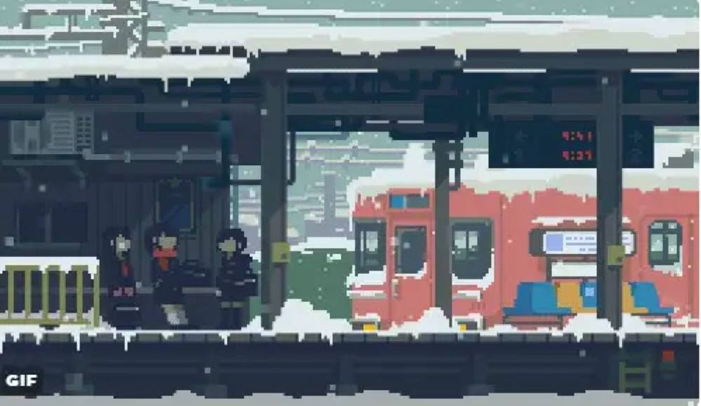
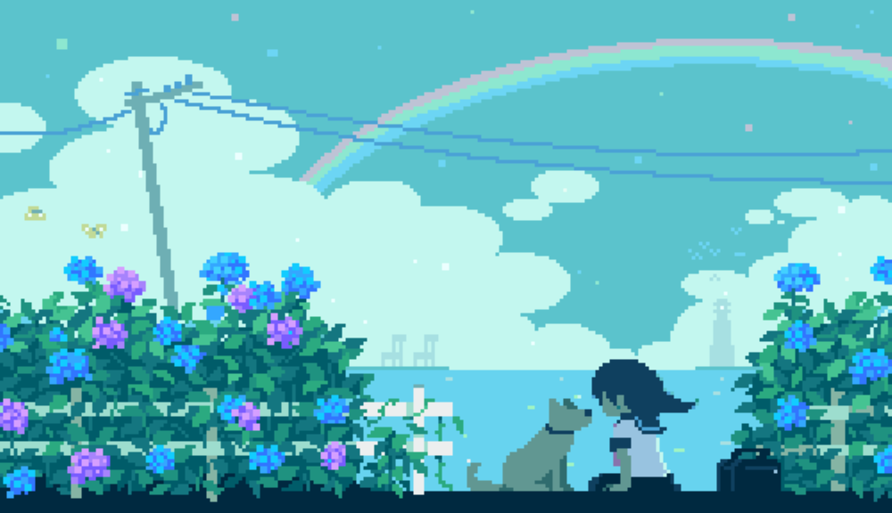
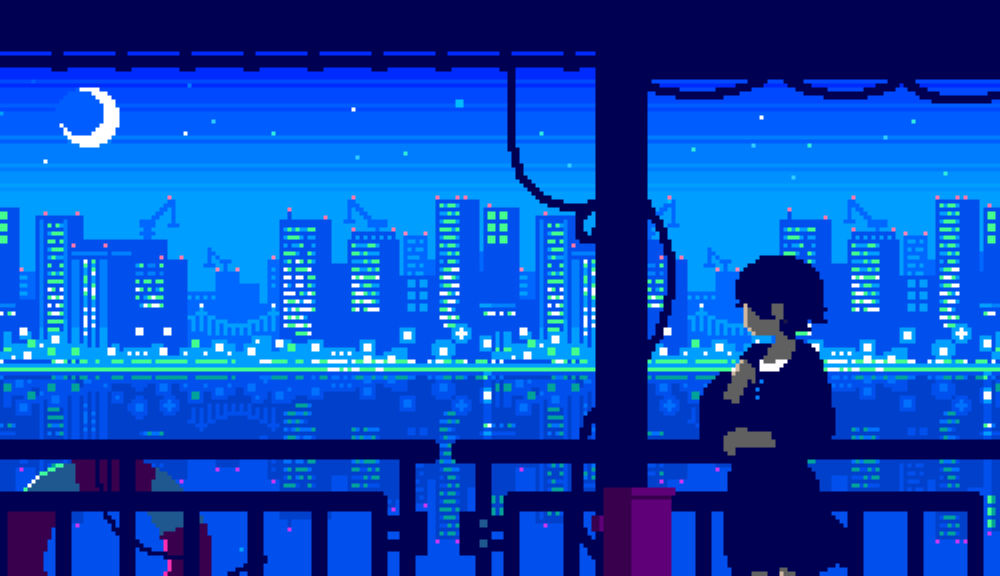

# 😘 你好，我是Pinpe，可能来自于另一个星球的人 ✨

## 🗃️ 身份证 | ID Card

    <h1>🍒 Pinpe</h1>
    <code>00后</code> <code>学生</code> <code>技术爱好者</code> <code>INTP-T</code> <code>微量二次元</code>
    <table>
    <tr>
        <td><b>♂️ 性别</b></td>
        <td>男</td>
    </tr>
    <tr>
        <td><b>🎂 生日</b></td>
        <td>2008年4月28日</td>
    </tr>
    <tr>
        <td><b>🐭 生肖</b></td>
        <td>鼠</td>
    </tr>
    <tr>
        <td><b>♉ 星座</b></td>
        <td>金牛座</td>
    </tr>
    <tr>
        <td><b>🌆 居住地</b></td>
        <td>江苏 常州</td>
    </tr>
    </table>

## 🔬 专业和技术栈 | Professional & Tech Stack

    <h1 style="text-align: center; margin-bottom: 8px;">✨ 学籍卡 ✨</h1>
    
🪶 持证人：Pinpe 🪶

    <ul>
        <li>🎓 五年一贯制大专</li>
        <li>🖥️ 计算机网络技术</li>
    </ul>

:::important
以下技术栈仅列出目前正在或经常使用的技术，不代表了解程度和熟练度。
:::

|用途|分类|技术栈|
|--|--|--|
|**🌍 网络开发**|语言|`HTML` `CSS` `JavaScript` `Python`|
||框架|`Flask` `MDUI` `jQuery` `Astro`|
|**🎮 游戏开发**|引擎|`RPG Maker` `Ren'Py`|
||语言|`Ren'Py Script`|
|**🧩 杂项**|代码编辑器|`Visual Studio Code`|
||数据交换格式|`JSON`|
||操作系统|`Windows` `Linux(WSL)`|
||Shell|`Nushell` `bash`|

## 🌾 精神食粮 | Food for thought

### 🎼 音乐

🚅 2023年寒假听的 **《延误列车》** ，是我听的第一首**VOCALOID音乐**，彻底改变了我的音乐偏好。

🥰 目前，我最喜欢的音乐作者是**海茶**，其中两首作品特别推荐：

    
🏖️ クモヒトデのうまる砂の上で

    
就在那埋着蛇尾海星的沙滩之上

    
🛤️ なんとか鉄道の夕

    
尽力而行的铁道黄昏

### 🎮 游戏

🌳 我的游戏史可以追溯到小学一年级，当时第一个喜欢的游戏就是 **《Minecraft》**，算起来也是9年老玩家了。

👾 直到目前，我也钟爱于**独立**、**像素风**、**剧情优先**的游戏，例如 **《OMORI》**、**《Deltarune》**、**《OneShot》** 等。

## 📮 联系方式 | Contact

:::warning
原QQ号**813233375**已成为小号，建议联系新号。
:::

<table>
<tr>
    <td><b>🐧 QQ</b></td>
    <td><a href="https://qm.qq.com/q/IilUtyt28K" target="_blank">3776284379</a></td>
</tr>
<tr>
    <td><b>📫 邮箱</b></td>
    <td><a href="mailto:813233375@qq.com" target="_blank">813233375@qq.com</a></td>
</tr>
<tr>
    <td><b>📺 哔哩哔哩</b></td>
    <td><a href="https://space.bilibili.com/1099587474" target="_blank">1099587474</a></td>
</tr>
<tr>
    <td><b>🦾 Steam</b></td>
    <td><a href="https://steamcommunity.com/profiles/76561199468532983/" target="_blank">1508267255</a></td>
</tr>
</table>