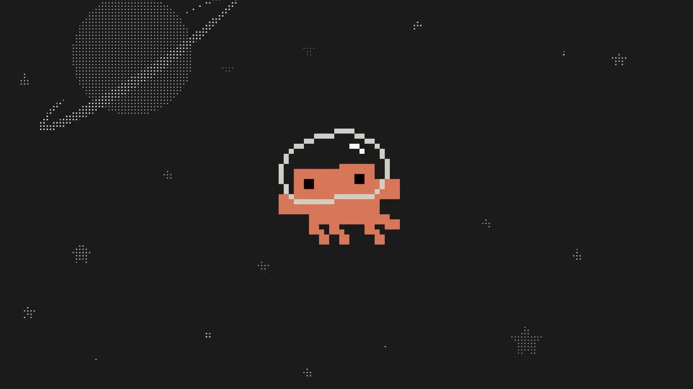

# 👋 はじめまして、私は Pinpe です！ ✨

你好，我是**Pinpe**，出生在**2008年**的**常州**，是**计算机网络技术**专业的五年制大专生，将在2029年毕业。

我之前进行过一次16型人格检测，是**INTP-T（逻辑学家）**？

私は**日本語を勉強している**、もう**JLPT N5がある**。

---

以下是我常用的技术栈：

    

        操作系统
        EndeavourOS（基于Arch）
    

    

        语言框架
        Python、Flask、jQuery
    

    

        游戏开发
        RPG Maker、Ren'Py
    

    

        AI工具
        Claude Code
    

    

        Shell
        Fish
    

    

        代码编辑器
        Visual Studio Code
    

---

我一般听**Vocaloid**和**日本民乐**，喜欢的作者有：

    
Namitape

    
主打怀旧、节奏感，也精通PV制作，代表作为《flitter》专辑。

    
海茶

    
主打故事感、旋律和节奏感，风格偏向海鲜，代表作为《おどロボ》和《幕を下ろそう、パレードへ》

而游戏方面一般玩**像素风、小众、独立**的游戏，例如 [《Deltarune》](https://deltarune.com/) 、 [《OMORI》](https://www.omori-game.com/) 、 [《Minecraft》](https://www.minecraft.net/zh-hans) 等。

---

你可以通过以下方式联系我：

    

        邮箱
        813233375@qq.com
    

    

        QQ
        3776284379
    

    

        哔哩哔哩
        1099587474
    

